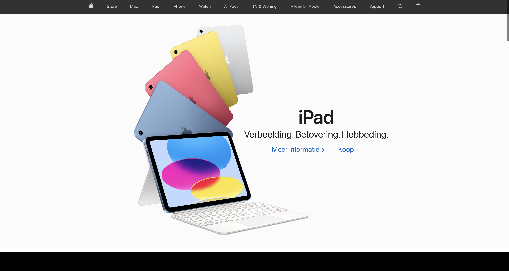
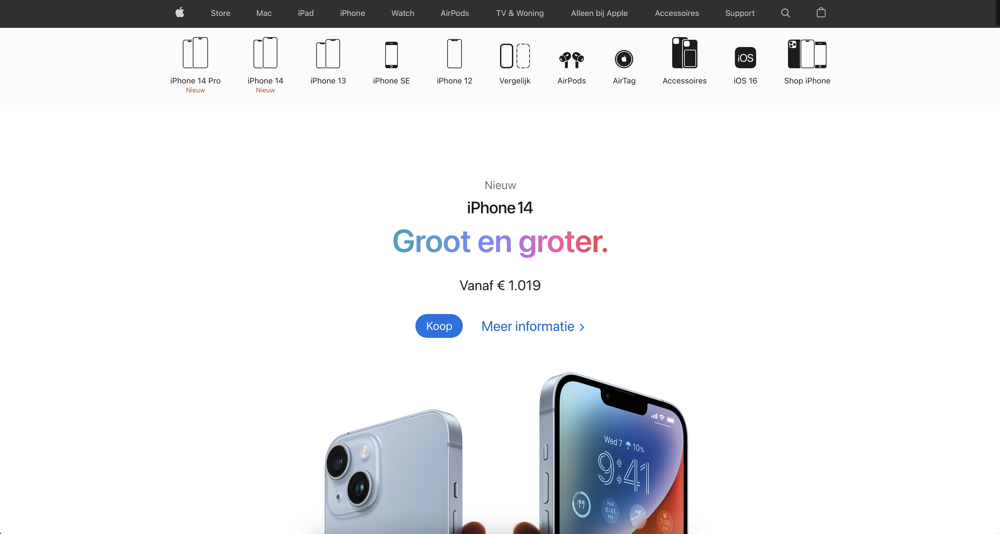
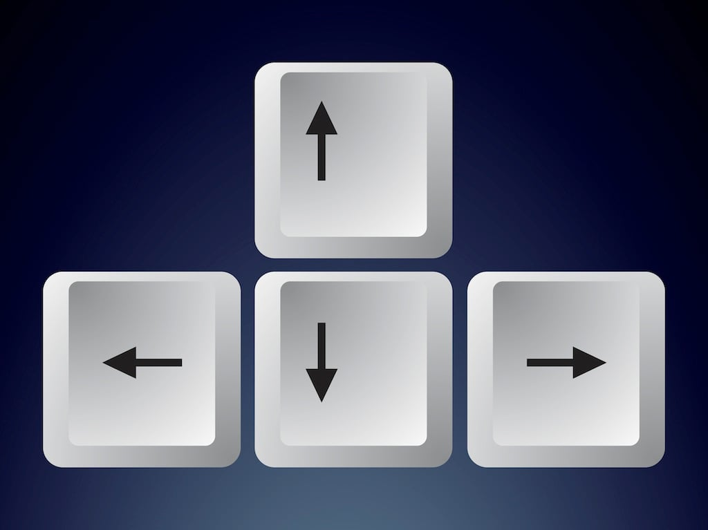

# Procesverslag
Markdown is een simpele manier om HTML te schrijven.  
Markdown cheat cheet: [Hulp bij het schrijven van Markdown](https://github.com/adam-p/markdown-here/wiki/Markdown-Cheatsheet).

Nb. De standaardstructuur en de spartaanse opmaak van de README.md zijn helemaal prima. Het gaat om de inhoud van je procesverslag. Besteedt de tijd voor pracht en praal aan je website.

Nb. Door *open* toe te voegen aan een *details* element kun je deze standaard open zetten. Fijn om dat steeds voor de relevante stuk(ken) te doen.

## Jij

  
uitwerken voor kick-off werkgroep

  ### Auteur:
  Ali Ahmed
  #### Je startniveau:
  Rood

  #### Je focus:
  Surface plane
 

## Je website

  
uitwerken voor kick-off werkgroep

  ### Je opdracht:
  https://www.apple.com/nl/

  #### Screenshot(s) van de eerste pagina (small screen): 
  Homepagina van Apple
  

  #### Screenshot(s) van de tweede pagina (small screen):
  Iphone pagina Apple 
  
 

## Toegankelijkheidstest 1/2 (week 1)

  
uitwerken na test in 1e werkgroep

  ### Bevindingen

  #### Screenreader
  De screenreader functie is heel chaotisch. Als blind persoon lijkt het me ook heel moeilijk om uberhaupt
  aanpassingen te maken aan de snelheid, stem, etc. Op de website zelf gaf hij wel de onderdelen aan
  maar met te veel extra informatie die niet relevant is. 

  #### Muis en Toetsenbord 
  Tijdens het gebruiken van beide tools ging het wel lastig. Ik kon moeilijk navigeren met de muis
  vanwege mijn beperking. Daarom gebruikte ik de "TAB" knop op mijn laptop. Ik kon via de screenreader
  zo weten waar ik was maar toch niet duidelijk genoeg. De lading aan informatie zorgt voor onduidelijk
  heden waardoor het lastig was om de website te gebruiken. 

  Misschien zou het handig zijn om iets met de pijltjes van het toetsenbord te kunnen. In plaats van
  alleen maar te tabben, bijvoorbeeld.

   

  #### Motoriek (shocks, elastiekjes)
  Met de parkinson triller was het niet te doen. Ik kon mijn macbook niet eens aanraken en het ging 
  allemaal veelste moeilijk. Ik probeerde via mijn keyboard te bewegen wat vrij aardig maar toch 
  niet soepel genoeg lukte. 

  Doormiddel van de knoppen uit elkaar te zetten, die iemand met parkinson kan gebruiken. Zo verkomen
  ze namelijk dat ze perongeluk de rechter of linker knop toetsen ipv van de gewenste knop. 

  

  #### Visueel (brillen, contrast, kleurenblind, dark/light). 
  Ik heb ook de brillen gedragen. Elke bril kwam met een beperking, al moet ik wel zeggen dat de gele
  bril het minst beperkt overkwam. Ik snap dat ik mij dan moest voorstellen als iemand die kleurenblind is. 
  De bril met de bedekte zijdes was ook redelijk geen dilemma. De wazige en de zwarte stip bril zorgte 
  wel voor allemaal complicaties. Ik kon namelijk niet zien waar ik navigeerde en waar ik naar toe 
  wilde gaan.

  Het is natuurlijk moeilijk om uberhaupt te kunnen navigeren als slechtziende. Voor kleurblinden 
  (Die dus wel nog steeds kunnen zien), een optie toevoegen waardoor zij misschien een tekstje op 
  de kleur zien. Zo is dat groen juist misschien wel rood, alleen hebben ze dat niet door. 

  

## Breakdownschets (week 1)

  
uitwerken na afloop 2e werkgroep

  ### de hele pagina: 
  

  ### dynamisch deel (bijv menu): 
  

  ### wellicht nog een dynamisch deel (bijv filter): 
  

## Voortgang 1 (week 2)

  
uitwerken voor 1e voortgang

  ### Stand van zaken
  hier dit ging goed & dit was lastig (neem ook screenshots op van delen van je website en code)

  ### Agenda voor meeting
  samen met je groepje opstellen

  | student 1      | student 2          | student 3    | student 4        |
  | ---            | ---                | ---          | ---              |
  | dit bespreken  | en dit             | en ik dit    | en dan ik dat    |
  | en dat ook nog | dit als er tijd is | nog een punt | dit wil ik zeker |
  | ...            | ...                | ...          | ...              |

  ### Verslag van meeting
  hier na afloop snel de uitkomsten van de meeting vastleggen

  - punt 1
  - punt 2
  - nog een punt
  - ...

## Voortgang 2 (week 3)

  
uitwerken voor 2e voortgang

  ### Stand van zaken
  hier dit ging goed & dit was lastig (neem ook screenshots op van delen van je website en code)

  ### Agenda voor meeting
  samen met je groepje opstellen

  | Dana           | Robin              | Tristan      | Bronger          |
  | ---            | ---                | ---          | ---              |
  | dit bespreken  | en dit             | en ik dit    | en dan ik dat    |
  | en dat ook nog | dit als er tijd is | nog een punt | dit wil ik zeker |
  | ...            | ...                | ...          | ...              |

  ### Verslag van meeting
  hier na afloop snel de uitkomsten van de meeting vastleggen

  - punt 1
  - punt 2
  - nog een punt
- ...

## Toegankelijkheidstest 2/2 (week 4)

  
uitwerken na test in 8e werkgroep

  ### Bevindingen
  Lijst met je bevindingen die in de test naar voren kwamen (geef ook aan wat er verbeterd is):

  #### Screenreader
  Hier korte omschrijving (met indien nodig afbeeldingen)

  Hier een omschrijving van hoe het opgelost kan worden (met indien nodig afbeeldingen)

  #### Muis en Toetsenbord 
  Hier korte omschrijving (met indien nodig afbeeldingen)

  Hier een omschrijving van hoe het opgelost kan worden (met indien nodig afbeeldingen)

  #### Motoriek (shocks, elastiekjes)
  Hier korte omschrijving (met indien nodig afbeeldingen)

  Hier een omschrijving van hoe het opgelost kan worden (met indien nodig afbeeldingen)

  #### Visueel (brillen, contrast, kleurenblind, dark/light). 
  Hier korte omschrijving (met indien nodig afbeeldingen)

  Hier een omschrijving van hoe het opgelost kan worden (met indien nodig afbeeldingen)

## Voortgang 3 (week 4)

  
uitwerken voor 3e voortgang

  ### Stand van zaken
  hier dit ging goed & dit was lastig (neem ook screenshots op van delen van je website en code)

  ### Agenda voor meeting
  samen met je groepje opstellen

  | student 1      | student 2          | student 3    | student 4        |
  | ---            | ---                | ---          | ---              |
  | dit bespreken  | en dit             | en ik dit    | en dan ik dat    |
  | en dat ook nog | dit als er tijd is | nog een punt | dit wil ik zeker |
  | ...            | ...                | ...          | ...              |

  ### Verslag van meeting
  hier na afloop snel de uitkomsten van de meeting vastleggen

  - punt 1
  - punt 2
  - nog een punt
  - ...

## Eindgesprek (week 5)

  
uitwerken voor eindgesprek

  ### Je uitkomst - karakteristiek screenshots:
  

  ### Dit ging goed/Heb ik geleerd: 
  Korte omschrijving met plaatjes

  

  ### Dit was lastig/Is niet gelukt:
  Korte omschrijving met plaatjes

  

## Bronnenlijst

  
continu bijhouden terwijl je werkt

  Nb. Wees specifiek ('css-tricks' als bron is bijv. niet specifiek genoeg).

  1. bron 1
  2. bron 2
  3. ...

