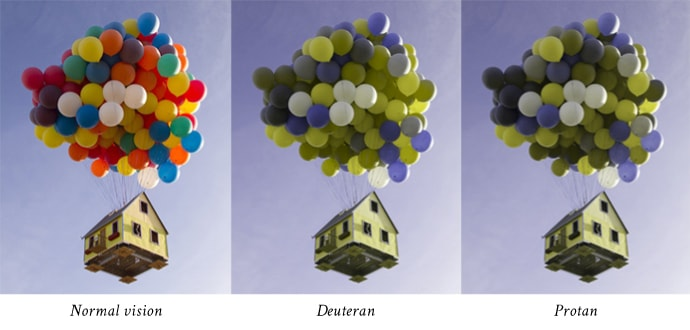
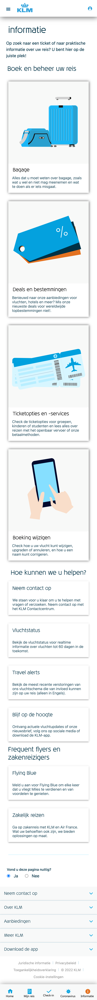

# Procesverslag
Markdown is een simpele manier om HTML te schrijven.  
Markdown cheat cheet: [Hulp bij het schrijven van Markdown](https://github.com/adam-p/markdown-here/wiki/Markdown-Cheatsheet).

Nb. De standaardstructuur en de spartaanse opmaak van de README.md zijn helemaal prima. Het gaat om de inhoud van je procesverslag. Besteedt de tijd voor pracht en praal aan je website.

Nb. Door *open* toe te voegen aan een *details* element kun je deze standaard open zetten. Fijn om dat steeds voor de relevante stuk(ken) te doen.

## Jij

  
uitwerken voor kick-off werkgroep

  ### Auteur:
  Ali Ahmed
  #### Je startniveau:
  Rood

  #### Je focus:
  Surface plane
 

## Je website

  
uitwerken voor kick-off werkgroep

  ### Je opdracht:
  https://www.klm.nl/
  #### Screenshot(s) van de eerste pagina (small screen): 
  Homepagina van KLM
  

  #### Screenshot(s) van de tweede pagina (small screen):
  Informatie pagina van KLM 
  
 

## Toegankelijkheidstest 1/2 (week 1)

  
uitwerken na test in 1e werkgroep

  ### Bevindingen

  #### Screenreader
  De screenreader functie is heel chaotisch. Als blind persoon lijkt het me ook heel moeilijk om uberhaupt
  aanpassingen te maken aan de snelheid, stem, etc. Op de website zelf gaf hij wel de onderdelen aan
  maar met te veel extra informatie die niet relevant is. 

  #### Muis en Toetsenbord 
  Tijdens het gebruiken van beide tools ging het wel lastig. Ik kon moeilijk navigeren met de muis
  vanwege mijn beperking. Daarom gebruikte ik de "TAB" knop op mijn laptop. Ik kon via de screenreader
  zo weten waar ik was maar toch niet duidelijk genoeg. De lading aan informatie zorgt voor onduidelijk
  heden waardoor het lastig was om de website te gebruiken. 

  Misschien zou het handig zijn om iets met de pijltjes van het toetsenbord te kunnen. In plaats van
  alleen maar te tabben, bijvoorbeeld.

   

  #### Motoriek (shocks, elastiekjes)
  Met de parkinson triller was het niet te doen. Ik kon mijn macbook niet eens aanraken en het ging 
  allemaal veelste moeilijk. Ik probeerde via mijn keyboard te bewegen wat vrij aardig maar toch 
  niet soepel genoeg lukte. 

  Doormiddel van de knoppen uit elkaar te zetten, die iemand met parkinson kan gebruiken. Zo verkomen
  ze namelijk dat ze perongeluk de rechter of linker knop toetsen ipv van de gewenste knop. 

  

  #### Visueel (brillen, contrast, kleurenblind, dark/light). 
  Ik heb ook de brillen gedragen. Elke bril kwam met een beperking, al moet ik wel zeggen dat de gele
  bril het minst beperkt overkwam. Ik snap dat ik mij dan moest voorstellen als iemand die kleurenblind is. 
  De bril met de bedekte zijdes was ook redelijk geen dilemma. De wazige en de zwarte stip bril zorgte 
  wel voor allemaal complicaties. Ik kon namelijk niet zien waar ik navigeerde en waar ik naar toe 
  wilde gaan.

  Het is natuurlijk moeilijk om uberhaupt te kunnen navigeren als slechtziende. Voor kleurblinden 
  (Die dus wel nog steeds kunnen zien), een optie toevoegen waardoor zij misschien een tekstje op 
  de kleur zien. Zo is dat groen juist misschien wel rood, alleen hebben ze dat niet door. 

  

## Breakdownschets (week 1)

  
uitwerken na afloop 2e werkgroep

  ### de hele pagina: 
  

  ### dynamisch deel (bijv menu): 
  

  ### wellicht nog een dynamisch deel (bijv filter): 
  

## Voortgang 1 (week 2)

  
uitwerken voor 1e voortgang

  ### Stand van zaken
  ik wilde graag tabjes toevoegen die ook op de KLM-site stonden. Doormiddel van deze tabjes kan de gebruiken namelijk kiezen
  of ze via de reguliere manier konden boeken of zouden kunnen boeken via miles. Ik heb op een aantal sites lopen kijken
  want het zou super handig zijn om gebruik te kunnen maken van je miles als je een ferquente vlieger bent. Ongeacht je 
  beperking. 

  

  

  ### Agenda voor meeting
  samen met je groepje opstellen

  | Ali            | Dana               | Robin        | Tristan           |
  | ---            | ---                | ---          | ---              |
  | dit bespreken  | en dit             | en ik dit    | en dan ik dat    |
  | en dat ook nog | dit als er tijd is | nog een punt | dit wil ik zeker |
  | ...            | ...                | ...          | ...              |

  ### Verslag van meeting
  hier na afloop snel de uitkomsten van de meeting vastleggen

  - De width van de browser zorgt ervoor dat alles niet goed zit.
  - Stof van de lessen toepassen (Minder op W3schools zitten)
  - De tabjes hoeven niet persee te werken, het gaat om hoe het eruit ziet.
  - ...

## Voortgang 2 (week 3)

  
uitwerken voor 2e voortgang

  ### Stand van zaken
  Naar de li's kijken van mijn UL. Er is geen sectie op de KLM website genaamd: "KLM Holidays". Hier is een
  horizontale scroll aanwezig waar de gebruiker tussen landen kan kiezen. Ik gebruikte eerste alleen a-tags, 
  maar ik had al een vermoedde dat het niet zo gedaan moest worden. ik heb een UL toegepast, die Li-tags bevatten
  en a's. Het enige probleem is dat binnen de a, een h3-tag en p in zitten. Ik wilde een achtergrond toepassen, 
  maar dat werkte per individueel element en niet de hele parent. 

  ### Agenda voor meeting
  samen met je groepje opstellen

  | Dana           | Robin              | Tristan      | Bronger          |
  | ---            | ---                | ---          | ---              |
  | dit bespreken  | en dit             | en ik dit    | en dan ik dat    |
  | en dat ook nog | dit als er tijd is | nog een punt | dit wil ik zeker |
  | ...            | ...                | ...          | ...              |

  ### Verslag van meeting
  Vasilis hielp me doormiddel van een div te gebruiken voor vormgeving. Dan mag je het namelijk wel gebruiken en
  om position absolute te gebruiken om de transparente blauw achtergronden de positioneren binnen het kader van de 
  section waar ook de bestemming foto in zit. Dit geldt ook voor het "Reis Verrijken" gedeelte die later op de website 
  komt.

  - Lestof toepassen! Niet van externe websites.
  - Niet alles hoeft te werken (Dus niet alles letterlijk uitwerken).
  - Begrijpen wat de code betekent en ervoor zorgen dat ik de JUISTE tags gebruik.
- ...

## Toegankelijkheidstest 2/2 (week 4)

  
uitwerken na test in 8e werkgroep

  ### Bevindingen
  De website van KLM hoeft niet persee toegankelijk te zijn voor iedereen omdat niet iedereen ook 
  instaat is om te reizen (Die een beperking hebben.) Voor hen die toch wel op reis willen gaan, zijn
  er bepaalde mogelijkheden, zoals een screenreader toegepast. In principe werkt het contrast van KLM prima
  want de website is wit met donkere kopjes, teksten en andere elementen die het toch wat duidelijker maken dan 
  een website met totaal verkeerde kleuren. Iemand die kleurenblind is zou best op de KLM-site kunnen zitten omdat
  de relevantie ligt in het boeken van een vlucht.

  #### Screenreader
  De screenreader werkt super goed via het aria-label! De originele website van KLM had een vrijwel
  onduidelijk aria label. Te specifiek en te VEEL informatie wordt voorgelezen. Het is de bedoeling dat 
  de gebruiker (met de beperking), moet begrijpen wat er in de website getoond wordt zonder echt te hoeven 
  kijken. Ik heb voornamelijk uitgelegd dat er op de knop gedrukt kan worden om een bepaalde actie door
  te voeren. 

  #### Muis en Toetsenbord 
  Via de tab-knop kan de gebruiker navigeren. De focus state komt te voorschijn en geeft de gebruiker aan waar
  hij/zij zich bevindt. Eerlijk gezegd vind ik de focus-state van de KLM een beetje onduidelijk dus heb ik ervoor
  gekozen om de box-shadow donkerder te maken. Zo kan je beter als gebruiker zien WAAR je je bevindt. 

  #### Motoriek (shocks, elastiekjes)
  Online heb ik ontdekt dat mensen met Parkinson een speciaal toetsenbord kunnen aanschaffen. In principe, omdat je dus
  ook met de pijltjes toets opties kan maken; het zeker van pas zou komen. De KLM site kan zeker bediend worden met 
  de volgende knoppen: Tab, Pijltjes, enter, etc. Dankzij het toepassen van de aria-label is daar dus meer duidelijkheid
  bij gezet. 

  #### Visueel (brillen, contrast, kleurenblind, dark/light). 
  Zoals ik melde bij mijn bevindingen, is dat de website heel goed werkt voor mensen met zicht beperkingen. Eerlijk
   gezegd vind ik het best gewaagd om als blind persoon op reis te gaan maar we moeten op een lijn blijven. De aria-label
   kan heel goed helpen + stel dat de beperkte persoon slecht zicht heeft, werken de kleuren goed in combinatie zonder 
   dat je te hard moet kijken. Wit + de donkere kleuren zorgt voor een duidelijk effect die je niet kan missen. 

## Voortgang 3 (week 4)

  
uitwerken voor 3e voortgang

  ### Stand van zaken
  Ik had moeite met het formulier, label en input. Ik begreep wat ze in hielden maar me de states werken
  was wel vrij lastig. Tot dat ik er achter kwam dat je dus :valid en :invalid kan toepassen in de CSS. 
  Een zeer helpend middel voor het geval ik dus wil aankaarten wat de gebruiker ingevoerd heeft. 

  Verder beperkte ik mezelf met het NIET gebruiken van ul's, terwijl daar nergens iets over gezegd is 
  (Dat je het niet mag gebruiken). De ULs helpen heel erg omdat de KLM website ze ook veel in de soort
  bestemmingen opties aanbiedt. 

  ### Agenda voor meeting
  samen met je groepje opstellen

  | Ali            | Dana               | Robin        | Tristan        |
  | ---            | ---                | ---          | ---              |
  | dit bespreken  | en dit             | en ik dit    | en dan ik dat    |
  | en dat ook nog | dit als er tijd is | nog een punt | dit wil ik zeker |
  | ...            | ...                | ...          | ...              |

  ### Verslag van meeting
( Ik heb niet helemaal meekregen wat er deze keer bespreken werd omdat ik geconcentreerd verder ging werken!)
  - punt 1
  - punt 2
  - nog een punt
  - ...

## Eindgesprek (week 5)

  
uitwerken voor eindgesprek

  ### Je uitkomst - karakteristiek screenshots:
  
   

  ### Dit ging goed/Heb ik geleerd: 
  Ik vond het animeren van de SVG'tjes heel leuk! 
  Ik heb verschillende soorten animatie stijlen toegepast
  en via de CSS aangesproken met zowel de fill als soort animatie 
  

  ### Dit was lastig/Is niet gelukt:
Helaas lukte de radio-buttons niet helemaal. Ik begrijp de basis, en ook de valid en invalid states
maar ik wilde dus heel graag ervoor zorgen dat ALS de gebruiker "Ja" kiest, het label verdwijnt en 
dan een p-tag te voorschijn komt die hen dan voorziet van feedback. 
  

## Bronnenlijst

  
continu bijhouden terwijl je werkt

  Nb. Wees specifiek ('css-tricks' als bron is bijv. niet specifiek genoeg).

  1. https://developer.mozilla.org/en-US/docs/Web/HTML/Element/input
  2. https://developer.mozilla.org/en-US/docs/Web/HTML/Element/li
  3. https://developer.mozilla.org/en-US/docs/Web/CSS/CSS_Animations/Using_CSS_animations
  4. https://dlo.mijnhva.nl/d2l/le/content/437099/Home

